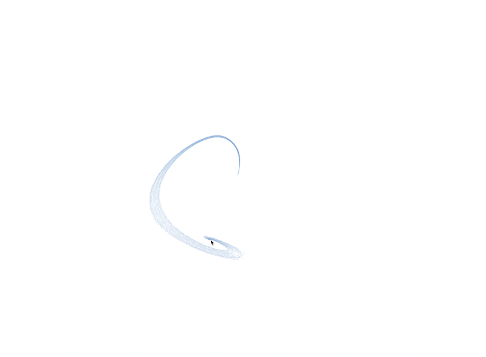

# Next Cursors


A Next.js library offering interactive cursor effects with ⁠[`CanvasCursor`](components/canvas-cursor/canvas-cursor.tsx) and [`⁠FluidCursor`](components/fluid-cursor/fluid-cursor.tsx) components. Utilizing HTML5 Canvas and physics-based animations, it creates smooth, captivating trailing effects that enhance user interactions. Perfect for adding dynamic, fluid visuals to your web applications.

## Want to learn more about how [`CanvasCursor`](components/canvas-cursor/canvas-cursor.tsx) and [`⁠FluidCursor`](components/fluid-cursor/fluid-cursor.tsx) work?

Read their respective READMEs in:

* [components/canvas-cursor](components/canvas-cursor)
* [components/fluid-cursor](components/fluid-cursor)

## Demos

You can view a live demo of:

* _Canvas Cursor_ [here](https://next-cursors-sandy.vercel.app/canvas-cursor).
* _Fluid Cursor_ [here](https://next-cursors-sandy.vercel.app/fluid-cursor).


_Canvas Cursor_

## Getting Started

Learn how to get _Next Cursors_ up and running for development.

### Prerequisites

Before you begin, ensure you have met the following requirements:

-  Node.js v18.17.0 or higher installed on your machine.

### Installation

**Clone the Repository**

```sh
git clone https://github.com/nicholasadamou/next-cursors.git
cd next-cursors
```

**Install Dependencies**

```sh
pnpm install
```

**Start the Development Server**

```sh
pnpm dev
```

**Visit _`canvas-cursor`_ or _`fluid_cursor`_ Pages**

To access _canvas-cursor_ page: `localhost:3000/canvas-cursor`.

To access _fluid_cursor_ page: `localhost:3000/fluid-cursor`.

### Deployment

This project can be [quickly deployed to Vercel](https://vercel.com/new/clone?repository-url=https%3A%2F%2Fgithub.com%nicholasadamou%2Fnext-cursors). Connect your Vercel account to your GitHub repository, and Vercel will automatically build and deploy your application with each new push to the main branch.

Add the project environment variables to your Vercel project settings.

## License

This project is licensed under the MIT License - see the [LICENSE](/LICENSE) file for details.
