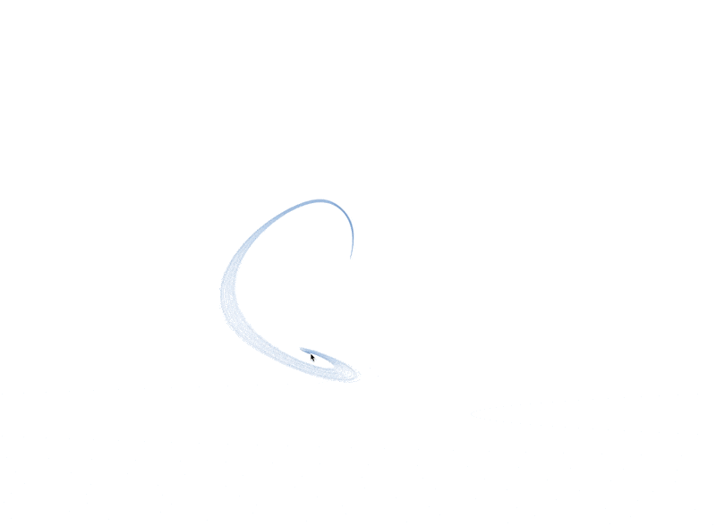

# [Canvas Cursor Component](canvas-cursor.tsx) and [useCanvasCursor Hook](../../hooks/use-canvas-cursor.ts)

The **Canvas Cursor Component** is a React-based interactive effect that creates a dynamic, animated trailing effect following the user's cursor. It utilizes HTML5 Canvas and a physics-based approach to simulate fluid motion. The component consists of:
- **CanvasCursor Component**: Manages rendering of the canvas.
- **useCanvasCursor Hook**: Handles animation logic.
- **Oscillator & Line Classes**: Control physics-based movement.

### Component Structure

#### **CanvasCursor Component**

- Determines if the user is on a mobile device and conditionally renders the canvas.
- Uses the `useCanvasCursor` hook to apply animations.

#### **useCanvasCursor Hook**

- Initializes the canvas, sets event listeners, and starts the animation loop.
- Updates the canvas by applying physics rules on multiple **Lines**.

#### **Line Class**

- Represents a flexible, physics-based entity that follows the cursor.
- Uses **Nodes** to create a trailing effect.

#### **Oscillator Class**

- Generates smooth, sine-wave-based variations for stroke color over time.

### Event Flow

The Canvas Cursor effect follows this event flow:

## State & Behavior

The Canvas Cursor effect transitions through various states and behaviors:

### Key Features

Some key features of the Canvas Cursor effect include:

- **Physics-Based Animation**: Uses a spring-mass system for smooth motion.
- **Dynamic Trail Effect**: Lines update their positions based on cursor movements.
- **Color Oscillation**: Stroke color continuously changes using the `Oscillator` class.
- **Optimized Rendering**: Uses `requestAnimationFrame` to ensure smooth performance.
- **Mobile Detection**: Disables the effect on mobile devices for usability.
