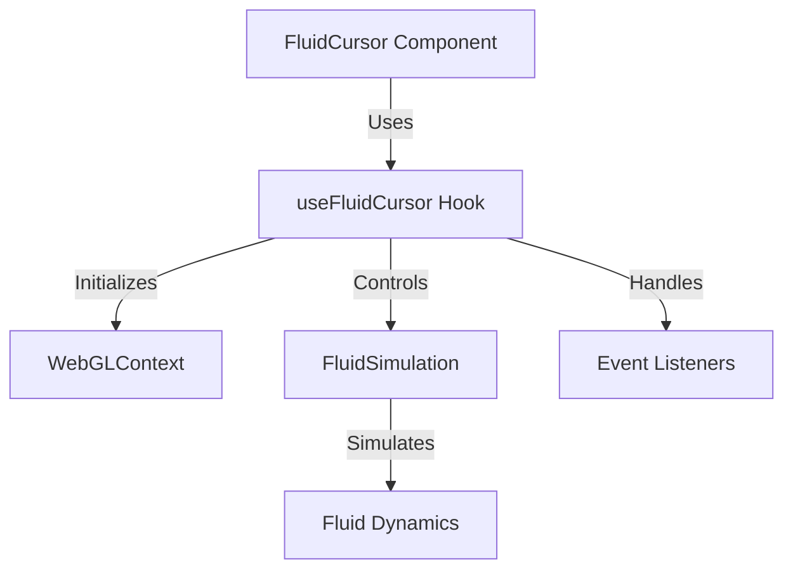
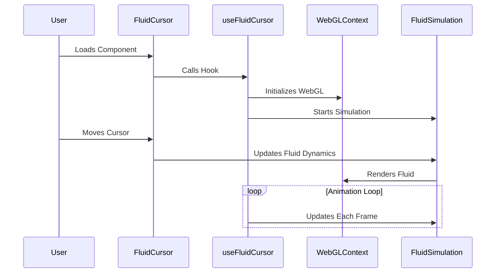
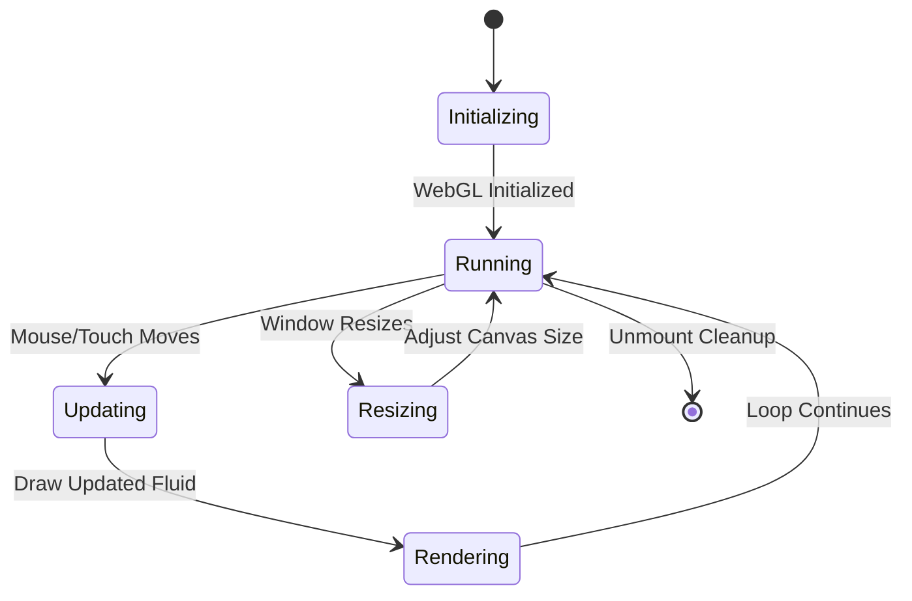

# [Fluid Cursor Component](fluid-cursor.tsx) and [useFluidCursor Hook](../../hooks/use-fluid-cursor.ts)

The **Fluid Cursor Component** is a React-based interactive effect that simulates fluid motion following the user's cursor. It leverages WebGL and advanced physics simulations to create a visually stunning, dynamic trailing effect. The component consists of:
-  **FluidCursor Component**: Manages rendering and interaction.
-  **useFluidCursor Hook**: Handles the fluid dynamics and animation logic.

## Component Structure

### **FluidCursor Component**

-  Renders a canvas element for fluid simulation.
-  Utilizes the `useFluidCursor` hook to manage fluid animations and interactions.

### **useFluidCursor Hook**

-  Initializes WebGL context and fluid simulation.
-  Sets up event listeners for mouse and touch interactions.
-  Manages the animation loop for fluid dynamics.

### **FluidSimulation Class**

-  Implements the physics-based fluid simulation.
-  Uses WebGL shaders to render fluid effects.

## Event Flow

## State & Behavior

## Key Features

-  **Physics-Based Fluid Simulation**: Creates realistic fluid motion using WebGL.
-  **Interactive Trail Effect**: Fluid dynamically responds to cursor movements.
-  **Optimized Rendering**: Utilizes `requestAnimationFrame` for smooth performance.
-  **Mobile Compatibility**: Handles touch interactions seamlessly.

## Conclusion

This component leverages **React Hooks, WebGL, and Physics Simulations** to create an engaging visual effect. Its modular design ensures maintainability while providing a fluid and immersive user experience.
